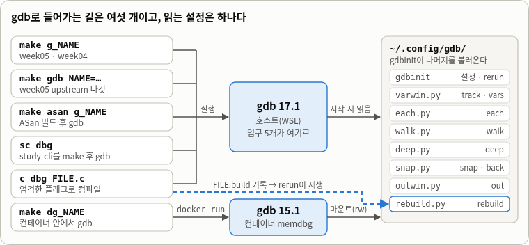
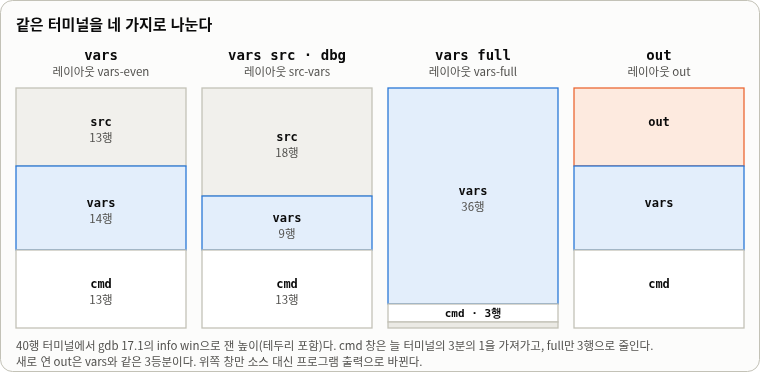
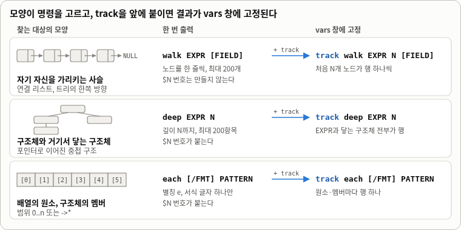
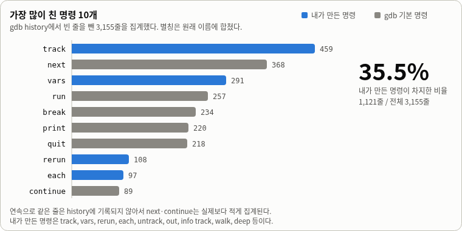

<!-- doc · scope: gdb-config 사용 안내(명령, 진입 경로, 빌드 플래그) · born: 2026-10-01 · status: 사실 검수 완료(2026-10-01), 모든 출력은 gdb 17.1(호스트)에서 실제로 돌려 얻었다 · truth: 코드가 이 글보다 앞선다 -->

# gdb-config

gdb TUI 위에 직접 만든 명령들과, 그 명령을 켜는 Makefile·래퍼를 정리한 문서다. 명령 이름이 아니라 상황을 기준으로 쓴다. 어떤 장면에서 기본 gdb가 불편했고, 그때 어떤 명령으로 풀었는지를 실제로 돌린 출력으로 보여 준다. 출력의 스택 주소(`0x7fffffff…`)는 환경 변수의 크기에 따라 실행마다 달라지고, 힙 주소(`0x5555…`)는 그대로다.

각 장은 명령표로 시작하고 시나리오가 뒤따르며, 장 끝의 Pitfalls는 참조용이다. 장 번호는 상황의 순서이고, 명령 이름으로 찾을 때는 맨 뒤의 [Index](#index)를 쓴다.

| 장 | 상황 |
|---|---|
| [0. Setup](#0-setup) | gdb를 어떻게 켜고, 화면이 어떻게 나뉘는가 |
| [1. Watching values](#1-watching-values) | 값이 바뀌는 것을 계속 지켜보고 싶다 |
| [2. Following structures](#2-following-structures) | 포인터로 이어진 구조를 한 번에 보고 싶다 |
| [3. Rewind and retry](#3-rewind-and-retry) | 죽은 자리에서 되돌아가고, 고쳐서 다시 돌리고 싶다 |
| [4. Separating output](#4-separating-output) | 프로그램의 출력을 gdb의 말과 따로 보고 싶다 |

## Install · Requirements

```bash
git clone https://github.com/benjohnbill/gdb-config ~/.config/gdb
```

gdb 17.1(Ubuntu)에서 확인했고 15.1에서도 로드된다. `set style`로 정한 색은 gdb 16 이상에서만 적용된다. Python과 TUI를 지원하는 gdb가 필요하다.

## 0. Setup

gdb를 켜는 길과 화면 배치를 정리한다. 나머지 장은 이 장의 환경을 전제한다.

<!-- WIL sheet 1 · left -->
### 0.1 Entry points

| Entry | Repo | Starts | `rerun` rebuilds by |
|---|---|---|---|
| `make g_NAME` | week05, week04 | `gdb ./build/NAME` (week04는 `-q -x scratch/walk.gdb`) | make |
| `make gdb NAME=…` | week05 | `gdb ./build/NAME` | make |
| `make asan g_NAME` | week05 | ASan·UBSan으로 빌드한 뒤 gdb (호스트 전용) | make (`build/`만 갱신, 3.4) |
| `sc dbg` | study-cli | `make -s` 후 `gdb -q --args study` | make |
| `c dbg FILE.c` | 어디서든 | 엄격한 플래그로 컴파일하고 `FILE.build`를 남긴 뒤 gdb | `FILE.build` 재생 |
| `make dg_NAME` | week05 | 컨테이너 `memdbg`(gdb 15.1) 안에서 `make g_NAME` | make |

### 0.2 Build flags

| Flag | gdb가 얻는 것 | Note |
|---|---|---|
| `-g` (`-g3`) | 소스 줄, 변수 이름, 구조체의 모양 | `track`·`walk`·`deep`·`each`는 이 정보로 식을 평가한다 |
| `-O0` | 변수가 최적화로 사라지지 않고, `next`가 소스 순서를 따른다 | |
| `-fno-omit-frame-pointer` | 프레임 포인터를 유지한다 | `-O0`에서는 이미 기본값이다. `-O1` 이상으로 올릴 때를 위한 안전장치다 |

주차마다 플래그가 다르다. week04는 `-g -O0`만 쓰고, week05는 여기에 `-fno-omit-frame-pointer`를 더한다. `c`와 study-cli는 `-g3`에 `-Werror`를 포함한 경고 플래그를 더해서, 경고 하나만 있어도 빌드가 실패하고 `rerun`도 거기서 멈춘다.
<!-- /WIL sheet 1 · left -->

<!-- WIL sheet 1 · right -->
### 0.3 Map



*그림 1. 입구 다섯 개는 호스트의 gdb 17.1로, `make dg_NAME`은 컨테이너의 gdb 15.1로 간다. 두 gdb는 같은 `~/.config/gdb`를 읽는다. 점선은 `c dbg`가 남긴 `FILE.build`를 `rerun`이 재생하는 경로다.*

### 0.4 Layouts



*그림 2. 40행 터미널에서 `info win`으로 잰 창 높이(테두리 포함)다. `vars`는 소스·값·명령 창을 3등분하고, `vars src`(별칭 `dbg`)는 소스 창을 키우고, `vars full`은 소스 창을 없앤다. `out`은 소스 자리에 프로그램 출력을 둔다.*
<!-- /WIL sheet 1 · right -->

### 0.5 Container

| Item | Host | Container (`dg_`) |
|---|---|---|
| gdb | 17.1 | 15.1. `set style` 색 설정은 건너뛴다 |
| glibc | 2.43 | 2.39. 20개 문제 중 2개만 결과가 다르다: 10번은 호스트에서 죽지 않고, 17번은 호스트 SIGABRT, 컨테이너 SIGSEGV |
| docker 옵션 | 없음 | `seccomp=unconfined`가 없으면 gdb가 주소 무작위화를 끄지 못해 경고가 뜨고 스택 주소가 실행마다 달라진다. `--cap-add=SYS_PTRACE`도 주지만 관찰된 차이는 없었다 |
| 설정 | `~/.config/gdb` | `~/.config/gdb`를 읽기·쓰기로, `~/.gdbinit`을 읽기 전용으로 마운트한다 |

설정 디렉터리를 쓰기 가능으로 마운트하는 이유는 gdb가 history를 그 안에 저장하기 때문이다. gdb는 history를 저장할 때 그 파일을 같은 디렉터리의 임시 이름(`history-gdb<pid>~`)으로 바꿨다가 되돌린다. 파일 하나만 마운트하면 이 이름 바꾸기가 거부되어 history가 저장되지 않는다.

### 0.6 Keys and focus

| Key / Command | 하는 일 |
|---|---|
| `Ctrl-x a` | TUI를 켜고 끈다 (gdb 기본) |
| `focus cmd` · `focus src` · `focus out` | 입력을 받을 창을 고른다. `vars`는 레이아웃을 연 뒤 `focus cmd`까지 실행한다 |
| `PageUp` · `PageDown` | 포커스가 있는 창을 스크롤한다. `out` 창에서 지난 출력을 볼 때 쓴다. 명령 창에서는 동작하지 않는다 |
| `cmdwin [ROWS]` | 명령 창 높이를 터미널에 맞춘다. 숫자는 희망값이라 터미널이 허용하는 만큼만 적용된다 |

## 1. Watching values

식의 값이 정지할 때마다 어떻게 바뀌는지 계속 지켜보는 상황이다.

<!-- WIL sheet 2 · left -->
### 1.1 Commands

| Command | Alias | What | Note |
|---|---|---|---|
| `track EXPR` | `tk` | 식을 vars 창에 고정한다. 값이 바뀌면 `*`와 `old -> new`로 표시한다 | |
| `track -l EXPR` | `tk -l` | 식의 값이 아니라 그 주소에 고정한다 | |
| `info track` | `itk` | 고정한 행의 번호와 식을 본다 | |
| `untrack N` | `utk` | N번 행을 지운다 | `N..M`, `..M`, `N..`도 된다. 인자가 없으면 전부 지운다 |

vars 창 맨 아래 줄이 기호의 뜻을 알려 준다. `*`는 직전 정지에 비해 값이 바뀐 행이고, `?`는 가장 안쪽 프레임에서 이름을 볼 수 없는 식이다.

행을 정리하는 모습이다.

```text
(gdb) tk e->len
(gdb) tk e->cap
(gdb) tk e->data
(gdb) info track
Num  Expression
1    e->len
2    e->cap
3    e->data
(gdb) untrack 2
(gdb) info track
Num  Expression
1    e->len
2    e->data
```
<!-- /WIL sheet 2 · left -->

<!-- WIL sheet 2 · right -->
### 1.2 Scenario

`10_realloc_dangling`에서 `eb_grow`에 멈춘다. `EditBuffer`는 원소를 하나 넣을 때마다 `len`이 늘고, 가득 차면 `cap`이 두 배가 되면서 `realloc`이 `data`의 주소를 바꿀 수 있다. 이 프로그램에서는 첫 번째 확장에서만 주소가 옮겨지고 이후에는 같은 주소에서 늘어난다. 첫 번째 확장에서 이 세 값이 어떻게 바뀌는지 보고 싶다.

기본 gdb는 정지할 때마다 `print`를 세 번 다시 쳐야 하고, 무엇이 바뀌었는지는 앞의 출력과 눈으로 비교해야 한다.

```text
(gdb) print e->len
$1 = 4
(gdb) print e->cap
$2 = 4
(gdb) print e->data
$3 = (int *) 0x555555559010
(gdb) finish
Run till exit from #0  eb_grow (e=0x7fffffffd260, need=5) at bug.c:78
eb_push (e=0x7fffffffd260, v=1) at bug.c:88
88          e->data[e->len++] = v;
(gdb) print e->len
$4 = 4
(gdb) print e->cap
$5 = 8
(gdb) print e->data
$6 = (int *) 0x555555559070
```

`track`은 세 식을 한 번만 고정해 둔다. 아래는 `finish`로 `eb_grow`를 빠져나온 직후의 화면이고, 아래쪽 명령 창은 생략했다. 바뀐 `cap`과 `data`에만 `*`가 붙고 이전 값이 함께 나온다. `len`은 그대로다.

```text
┌─bug.c────────────────────────────────────────────────────────────────────────────────┐
│    87     if (e->len == e->cap) eb_grow(e, e->len + 1);                              │
│  > 88     e->data[e->len++] = v;                                                     │
│    89 }                                                                              │
│    90                                                                                │
└──────────────────────────────────────────────────────────────────────────────────────┘
│  1 e->len  = 4                                                                       │
│* 2 e->cap  = 4 -> 8                                                                  │
│* 3 e->data = 0x555555559010 -> 0x555555559070                                        │
│ track <expr>  tk walk|deep|each …  untrack N..M  * moved  ? not visible here         │
└──────────────────────────────────────────────────────────────────────────────────────┘
multi-thre Thread 0x7ffff7fa47 (cmd) In: eb_push               L88   PC: 0x55555555547c
```
<!-- /WIL sheet 2 · right -->

### 1.3 Compared with display

기본 gdb의 `display`는 정지할 때마다 식을 다시 출력해 준다. 그러나 무엇이 바뀌었는지는 표시하지 않는다.

```text
Breakpoint 1, eb_grow (e=0x7fffffffd260, need=5) at bug.c:78
78          size_t nc = e->cap;
(gdb) display e->len
1: e->len = 4
(gdb) display e->cap
2: e->cap = 4
(gdb) display e->data
3: e->data = (int *) 0x555555559010
(gdb) continue
Continuing.

Breakpoint 1, eb_grow (e=0x7fffffffd260, need=9) at bug.c:78
78          size_t nc = e->cap;
1: e->len = 8
2: e->cap = 8
3: e->data = (int *) 0x555555559070
```

게다가 `display`는 식을 만든 블록에 묶인다. `finish`로 `eb_push`에 나오면 같은 `display` 세 개가 아무것도 출력하지 않는다. `track`의 행은 프레임이 바뀌어도 남아서 같은 자리에서 갱신된다.

```text
(gdb) finish
Run till exit from #0  eb_grow (e=0x7fffffffd260, need=5) at bug.c:78
eb_push (e=0x7fffffffd260, v=1) at bug.c:88
88          e->data[e->len++] = v;
```

### 1.4 Pitfalls

- 가장 안쪽 프레임이 이름을 볼 수 없으면(여기서는 libc의 `realloc` 안) 행은 마지막으로 읽은 값을 유지하고 `*` 대신 `?`가 붙는다.

```text
│                               [ No Source Available ]                                │
│                                                                                      │
│                                                                                      │
└──────────────────────────────────────────────────────────────────────────────────────┘
│? 1 e->len  = 4                                                                       │
│? 2 e->cap  = 4                                                                       │
│? 3 e->data = 0x555555559010                                                          │
│                                                                                      │
│                                                                                      │
│ track <expr>  tk walk|deep|each …  untrack N..M  * moved  ? not visible here         │
└──────────────────────────────────────────────────────────────────────────────────────┘
multi-thre Thread 0x7ffff7fa47 (cmd) In: __GI___libc_realloc   L3380 PC: 0x7ffff7cb56c0
```

- 가장 안쪽이 아닌 프레임을 `up`으로 고르면 `?`가 아니라 안내 문구가 나오고, 행은 다시 읽히지 않는다.

```text
│  > 80     int *p = realloc(e->data, nc * sizeof(int));                               │
│    81     if (!p) { perror("realloc"); free(e->data); exit(1); }                     │
│    82     e->data = p;                                                               │
│    83     e->cap = nc;                                                               │
└──────────────────────────────────────────────────────────────────────────────────────┘
│ reading frame ^1: values are from the last stop                                      │
│  1 e->len  = 4                                                                       │
│  2 e->cap  = 4                                                                       │
│  3 e->data = 0x555555559010                                                          │
│                                                                                      │
│ track <expr>  tk walk|deep|each …  untrack N..M  * moved  ? not visible here         │
└──────────────────────────────────────────────────────────────────────────────────────┘
multi-thre Thread 0x7ffff7fa47 (cmd) In: eb_grow               L80   PC: 0x5555555553ec
```

- `vars`를 `run` 뒤에 치면 소스 창이 멈춘 줄로 맞춰지지 않아 어디서 멈췄는지 보이지 않을 수 있다. `run` 전에 `vars`를 치거나 `frame`을 한 번 치면 된다.
- TUI에서 `finish`는 명령 창의 출력 순서를 뒤섞거나 화면 전체를 밀어 올리는 경우가 있다. 같은 증상이 tmux에서도 재현되므로 캡처 도구 탓이 아니다. `advance 줄번호`에서는 보이지 않았다.

## 2. Following structures

포인터로 이어진 구조를 따라가는 상황이다. 대상의 모양이 명령을 고른다.

<!-- WIL sheet 3 · left -->
### 2.1 Commands

| Command | Target | Output | Limit |
|---|---|---|---|
| `walk EXPR [FIELD]` | 자기 자신을 가리키는 포인터 사슬 | 노드마다 한 줄 | 200개, `$N` 없음 |
| `deep EXPR N` | 구조체와 거기서 닿는 구조체 | 항목마다 `$N` | 200항목, 깊이 N까지 |
| `each [/FMT] PATTERN` | 배열 원소, 구조체 멤버 | 원소마다 `$N` | 서식 글자 하나만 |


<!-- /WIL sheet 3 · left -->

<!-- WIL sheet 3 · right -->
### 2.2 Scenario

**사슬 (Q2_A_LL)**: `alternateMergeLinkedList`에 멈춰 둔 채로 `ll1`이 10, 20, 30, 40으로 이어져 있는지 확인한다. 기본 gdb는 `->next`를 하나씩 붙여 가며 print를 다시 치고, 끝에서는 NULL을 읽다가 오류로 끝난다.

기본 gdb (`gdb --nx`):

```text
(gdb) print *ll1->head
$1 = {item = 10, next = 0x55555555a450}
(gdb) print *ll1->head->next
$2 = {item = 20, next = 0x55555555a470}
(gdb) print *ll1->head->next->next
$3 = {item = 30, next = 0x55555555a490}
(gdb) print *ll1->head->next->next->next
$4 = {item = 40, next = 0x0}
(gdb) print *ll1->head->next->next->next->next
❌️ Cannot access memory at address 0x0
```

`walk` (내 설정):

```text
(gdb) walk ll1->head
  [0] 0x55555555a430  item=10  next=0x55555555a450
  [1] 0x55555555a450  item=20  next=0x55555555a470
  [2] 0x55555555a470  item=30  next=0x55555555a490
  [3] 0x55555555a490  item=40  next=0x0
  -> 총 4 개, next 를 따라갔다.
(gdb) walk ll2->head
  [0] 0x55555555a4b0  item=1  next=0x55555555a4d0
  [1] 0x55555555a4d0  item=2  next=0x55555555a4f0
  [2] 0x55555555a4f0  item=3  next=0x0
  -> 총 3 개, next 를 따라갔다.
```

**배열 (01_use_after_free)**: 위젯 네 개가 `items[8]`에 들어 있는 `Screen`에서, 닫힌 위젯이 어느 칸인지 한 줄로 묻는다. 각 줄의 `$N`은 값 히스토리 번호라서 `print $2`처럼 다시 쓸 수 있다.

```text
(gdb) each s.items[0..s.count-1]->closed
$1 s.items[0]->closed = 0
$2 s.items[1]->closed = 1
$3 s.items[2]->closed = 0
$4 s.items[3]->closed = 0
```
<!-- /WIL sheet 3 · right -->

### 2.3 Nested structs

**중첩 (01_use_after_free)**: `Screen`에서 `Widget`, `Widget`에서 `VTable`까지 세 단계가 포인터로 이어진다. 기본 gdb로 두 위젯만 훑는 데도 명령이 다섯 개 든다.

기본 gdb (`gdb --nx`):

```text
(gdb) print s
$1 = {items = {0x555555559010, 0x555555559040, 0x555555559070, 0x5555555590a0, 0x0, 0x0,
    0x0, 0x0}, count = 4}
(gdb) print *s.items[0]
$2 = {vtbl = 0x555555557d60 <LABEL_VT>, id = 10, closed = 0,
  label = "Welcome", '\000' <repeats 16 times>}
(gdb) print *s.items[0]->vtbl
$3 = {render = 0x5555555552a1 <label_render>,
  on_event = 0x555555555311 <widget_noop_event>}
(gdb) print *s.items[1]
$4 = {vtbl = 0x555555557d70 <DIALOG_VT>, id = 12, closed = 1,
  label = "Are you sure?\000\000\000\000\000\000\000\000\000\000"}
(gdb) print *s.items[1]->vtbl
$5 = {render = 0x5555555552d9 <dialog_render>,
  on_event = 0x5555555554d0 <dialog_on_event>}
```

`deep s 3`은 같은 구조를 한 명령으로 펼친다. 한 줄이 107~137칸이라 이 문서의 코드 블록에서는 가로로 스크롤된다. 터미널이 그보다 좁으면 gdb가 줄을 꺾는다(2.4).

```text
(gdb) deep s 3
$1 s = {items = {0x555555559010, 0x555555559040, 0x555555559070, 0x5555555590a0, 0x0, 0x0, 0x0, 0x0}, count = 4}
$2 s.items[0] = {vtbl = 0x555555557d60 <LABEL_VT>, id = 10, closed = 0, label = "Welcome", '\000' <repeats 16 times>}
$3 s.items[1] = {vtbl = 0x555555557d70 <DIALOG_VT>, id = 12, closed = 1, label = "Are you sure?\000\000\000\000\000\000\000\000\000\000"}
$4 s.items[2] = {vtbl = 0x555555557d50 <BUTTON_VT>, id = 11, closed = 0, label = "OK", '\000' <repeats 21 times>}
$5 s.items[3] = {vtbl = 0x555555557d50 <BUTTON_VT>, id = 13, closed = 0, label = "Cancel", '\000' <repeats 17 times>}
$6 s.items[0].vtbl = {render = 0x5555555552a1 <label_render>, on_event = 0x555555555311 <widget_noop_event>}
$7 s.items[1].vtbl = {render = 0x5555555552d9 <dialog_render>, on_event = 0x5555555554d0 <dialog_on_event>}
$8 s.items[2].vtbl = {render = 0x555555555269 <button_render>, on_event = 0x555555555311 <widget_noop_event>}
```

같은 구조체에 두 번 닿으면 한 번만 펼친다. `BUTTON_VT`를 `items[2]`와 `items[3]`이 함께 쓰기 때문에, 위젯은 네 개인데 vtable은 세 개만 나온다.

### 2.4 Pitfalls

- `walk`는 자기 자신을 가리키는 포인터가 있어야 쓸 수 있다. 배열이나 헤더 구조체에는 쓸 수 없고, 이때 안내 문구("name the field")는 막다른 길로 이어진다. 사슬은 `walk ll1->head`처럼 첫 노드에서 시작한다.

```text
(gdb) walk s
❌️ walk: no field of Screen points at Screen. name the field: walk EXPR FIELD
(gdb) walk s.items[0]
❌️ walk: no field of Widget points at Widget. name the field: walk EXPR FIELD
(gdb) walk s items
❌️ walk: 'items' does not point at Screen, so it cannot be followed. candidates: none
(gdb) walk s.items
❌️ walk: needs a struct or a pointer to one. this is Widget *[8]
```

- 사슬에 고리가 있으면 `walk`는 되돌아간 지점을 알려 주고 멈춘다.

```text
(gdb) walk ll2->head
  빈 사슬이다. (ll2->head 가 NULL)
(gdb) set var ll1->head->next->next = ll1->head
(gdb) walk ll1->head
  [0] 0x55555555a510  item=10  next=0x55555555a530
  [1] 0x55555555a530  item=1  next=0x55555555a510
  [2] 0x55555555a510  <- 여기서 [0] 로 되돌아간다. 고리다.
```

- `deep`·`each`·`walk`는 Python으로 출력하기 때문에, 한 줄이 터미널 폭을 넘으면 gdb가 단어 한가운데서 줄을 꺾는다(`'\0` 다음 줄에 `00'`).
- 배열에 NULL 슬롯이 있으면 `each`는 실패한 줄을 `$N` 없이 남기고, `deep`은 그 슬롯을 조용히 건너뛴다.

## 3. Rewind and retry

죽은 자리에서 원인 근처로 돌아가고, 소스를 고친 뒤 같은 세션에서 다시 돌리는 상황이다. 이 장에서는 `snap`이 남기는 표시를 깃발이라고 부른다. 출력에도 그렇게 나온다.

### 3.1 Commands

| Command | What | Note |
|---|---|---|
| `snap [LABEL]` | 지금 순간에 깃발을 남긴다 | `run`을 다시 하면 깃발이 사라진다 |
| `snaps` | 깃발 목록을 본다 | |
| `back [LABEL]` | 깃발을 남긴 순간으로 돌아간다 | 돌아간 뒤에도 같은 깃발로 다시 돌아올 수 있다 |
| `rebuild [TARGET]` | 실행 파일을 다시 빌드한다 | `FILE.build`가 있으면 그 명령을 재생하고, 없으면 `make` |
| `rerun` | 빌드하고, 프로세스를 끝내고, 새로 `run`한다 | 빌드가 실패하면 프로세스를 죽이지 않는다 |

`rerun`의 순서는 다음과 같다.

```text
rerun
├─ rebuild    FILE.build가 있으면 그 gcc 명령을 재생하고, 없으면 make NAME
│             └─ 실패하면 여기서 멈춘다 (프로세스는 그대로 산다)
├─ kill       살아 있는 프로세스를 끝낸다
├─ directory  소스 캐시를 비운다 (고친 소스가 보이게 한다)
└─ run        새 프로세스로 처음부터 시작한다
```

기본 gdb에도 `checkpoint`와 `restart`가 있다. 그러나 `restart`로 돌아간 체크포인트는 앞으로 실행하는 순간 소진된다. `back`은 돌아간 뒤에 같은 깃발을 다시 잡아 두기 때문에 몇 번이든 돌아올 수 있다.

### 3.2 Scenario · 죽은 자리에서 돌아오기

`02_stack_buffer_overflow`의 원본이다. 파스칼 삼각형을 채우는 루프가 `i <= rows`라서 배열 밖을 쓰고, 프로그램은 `main`이 끝나는 순간 `stack smashing detected`로 죽는다. 행 13(0부터 센다)을 채우는 첫 반복에서 멈춰 깃발을 남기고, 끝까지 실행해 죽게 한다. 프로그램의 표준 출력은 `> /dev/null`로 숨겼다(4장에서 따로 본다).

```text
(gdb) tbreak 68 if i == 13
Temporary breakpoint 1 at 0x11be: file /tmp/lab/bug.c, line 68.
(gdb) run > /dev/null
Starting program: /tmp/c.vGLcdjNt/bug > /dev/null
[Thread debugging using libthread_db enabled]
Using host libthread_db library "/usr/lib/x86_64-linux-gnu/libthread_db.so.1".

Temporary breakpoint 1, build_pascal (tri=0x7fffffffd220, rows=14) at /tmp/lab/bug.c:68
68                  int idx = tri_index(i, j);
(gdb) snap row13
깃발 -> 'row13'   (build_pascal, bug.c:68)
(gdb) continue
Continuing.

Program received signal SIGABRT, Aborted.
__pthread_kill_implementation (threadid=<optimized out>, signo=6, no_tid=0)
    at ./nptl/pthread_kill.c:44
⚠️ warning: 44   ./nptl/pthread_kill.c: No such file or directory
*** stack smashing detected ***: terminated
(gdb) bt -3
#7  __GI___fortify_fail (msg=msg@entry=0x7ffff7ddea70 "stack smashing detected")
    at ./debug/fortify_fail.c:24
#8  0x00007ffff7d45274 in __stack_chk_fail () at ./debug/stack_chk_fail.c:24
#9  0x000055555555542b in main () at /tmp/lab/bug.c:112
```

죽은 자리(`bug.c:112`)는 원인(66번째 줄)에서 46줄이나 떨어져 있다.

### 3.3 Scenario · 돌아와서 고치고 다시

깃발로 돌아와 값을 본다. 이어서 소스를 고치고(`i <= rows`를 `i < rows`로) `rerun`으로 같은 세션에서 다시 돌린다. `c dbg`로 연 세션에서는 빌드가 깨끗하면 출력이 조용하고, 고친 소스가 반영됐다는 흔적은 `has changed; re-reading symbols.` 한 줄뿐이다.

```text
(gdb) snaps
  row13  build_pascal, bug.c:68
  -> 총 1 개. 가장 최근은 'row13' 다.
(gdb) back row13
Switching to process 162294
#0  build_pascal (tri=0x7fffffffd220, rows=14) at /tmp/lab/bug.c:68
68                  int idx = tri_index(i, j);
복귀 -> 'row13'   (build_pascal, bug.c:68)
(gdb) print i
$1 = 13
(gdb) print j
$2 = 0
```

```text
(gdb) shell sed -i 's/i <= rows/i < rows/' bug.c
(gdb) rerun
[Inferior 1 (process 162459) killed]
`/tmp/c.CCfTFOQW/bug' has changed; re-reading symbols.
[Thread debugging using libthread_db enabled]
Using host libthread_db library "/usr/lib/x86_64-linux-gnu/libthread_db.so.1".
[Inferior 1 (process 162609) exited normally]
row  0: 1   (sum=1)
row  1: 1 1   (sum=2)
row  2: 1 2 1   (sum=4)
row  3: 1 3 3 1   (sum=8)
row  4: 1 4 6 4 1   (sum=16)
row  5: 1 5 10 10 5 1   (sum=32)
row  6: 1 6 15 20 15 6 1   (sum=64)
row  7: 1 7 21 35 35 21 7 1   (sum=128)
row  8: 1 8 28 56 70 56 28 8 1   (sum=256)
row  9: 1 9 36 84 126 126 84 36 9 1   (sum=512)
row 10: 1 10 45 120 210 252 210 120 45 10 1   (sum=1024)
row 11: 1 11 55 165 330 462 462 330 165 55 11 1   (sum=2048)
row 12: 1 12 66 220 495 792 924 792 495 220 66 12 1   (sum=4096)
row 13: 1 13 78 286 715 1287 1716 1716 1287 715 286 78 13 1   (sum=8192)
SIZE = 105
```

### 3.4 Pitfalls

- `run`을 다시 하면 깃발이 사라진다. `back`은 "깃발이 없다"고 답한다.

```text
(gdb) snap early
깃발 -> 'early'   (build_pascal, bug.c:66)
(gdb) run
Starting program: /tmp/c.PxBkuGzJ/bug
[Thread debugging using libthread_db enabled]
Using host libthread_db library "/usr/lib/x86_64-linux-gnu/libthread_db.so.1".

Breakpoint 1, build_pascal (tri=0x7fffffffd220, rows=14) at /tmp/lab/bug.c:66
66          for (int i = 0; i <= rows; i++) {
(gdb) back early
❌️ 깃발이 없다. snap 으로 먼저 찍을 것.
```

- `c dbg`의 `-Werror` 때문에 경고 하나로 `rebuild`가 실패한다. 이때 프로세스는 그대로 살아 있다.

```text
(gdb) shell sed -i 's/long sum = 0;/long sum = 0; int unused;/' bug.c
(gdb) rebuild
/tmp/lab/bug.c: In function ‘row_sum’:
/tmp/lab/bug.c:81:23: error: unused variable ‘unused’ [-Werror=unused-variable]
   81 |     long sum = 0; int unused;
      |                       ^~~~~~
cc1: all warnings being treated as errors
❌️ rebuild: gcc failed, keeping the current process
(gdb) print i
$5 = 13
(gdb) shell sed -i 's/ int unused;//' bug.c
(gdb) rebuild
```

- `c dbg`가 남긴 `FILE.build`를 재생하는 `rebuild`·`rerun`은 gcc 명령을 출력하지 않아서 깨끗한 빌드가 조용하다. make 경로(`make g_NAME`, `sc dbg` 등)는 매번 `make: Entering directory …`, 컴파일 명령줄, `make: Leaving directory …` 등을 출력한다.
- `make asan g_NAME`으로 연 세션에서 `rerun`은 `build/`의 일반 빌드만 새로 만들고, gdb가 올린 `build-asan/NAME`은 다시 빌드하지 않는다. 그래서 `rerun`은 고친 소스가 아니라 옛 ASan 바이너리를 다시 돌린다. gdb를 나와 `make asan g_NAME`을 다시 실행해야 한다. 코드를 읽고 `make -n`으로 확인한 결과이고, 세션에서 직접 돌려 보지는 않았다.
- `port_*` 바이너리는 같은 이름의 make 규칙이 없어서, `rebuild`가 "No rule to make target"을 내고 빌드를 건너뛴다. 이것도 `make -n`으로 확인했을 뿐 세션에서 돌려 보지는 않았다.

## 4. Separating output

프로그램의 출력이 gdb의 말과 뒤섞여 읽기 어려운 상황이다.

### 4.1 Commands

| Command | What |
|---|---|
| `out` | 프로그램 출력 창이 있는 레이아웃을 연다 |
| `out send TEXT` | 프로그램의 터미널에 한 줄을 입력한다. 실행 중에는 프롬프트가 없으므로 `run` 전에 보내 두거나 `run &`로 띄운 뒤 보낸다 |
| `out off` · `out on` | 프로그램의 터미널을 실제 터미널로 돌려주거나(`off`) 다시 출력 창으로 가져온다(`on`). 프로그램이 실행 중이면 거부되고 다음 `run`부터 적용된다 |

`focus out`을 한 뒤 `PageUp`·`PageDown`으로 지난 출력을 본다. `out` 레이아웃에는 소스 창이 없다. 소스는 편집기에서 읽는 것을 전제로 한다.

### 4.2 Scenario · 출력을 따로 보기

일반 모드에서는 프로그램의 출력이 다음 프롬프트에서 뒤늦게 에코되어, 3장처럼 `Program received signal SIGABRT` 보고 뒤에 나타난다. 20줄을 넘으면 에코 대신 `[out] N lines of program output; "out" reads them` 한 줄만 나온다. `out` 레이아웃은 출력을 위쪽 창에 따로 모은다. 같은 프로그램을 죽을 때까지 돌리면 창 높이만큼의 최근 줄(여기서는 5줄)이 보이고, 푸터가 지난 출력이 얼마나 더 있는지 알려 준다. glibc가 stderr로 내는 한 줄이 stdout 뒤에 순서대로 놓인다.

```text
┌─out──────────────────────────────────────────────────────────────────────────────────┐
│row 11: 1 11 55 165 330 462 462 330 165 55 11 1   (sum=2048)                          │
│row 12: 1 12 66 220 495 792 924 792 495 220 66 12 1   (sum=4096)                      │
│row 13: 1 13 78 286 715 1287 1716 1716 1287 715 286 78 13 1   (sum=8192)              │
│SIZE = 105                                                                            │
│*** stack smashing detected ***: terminated                                           │
│ 16 lines, 11 more above: focus out then PageUp                                       │
└──────────────────────────────────────────────────────────────────────────────────────┘
│ nothing tracked yet                                                                  │
│                                                                                      │
│                                                                                      │
│                                                                                      │
│                                                                                      │
│ track <expr>  tk walk|deep|each …  untrack N..M  * moved  ? not visible here         │
└──────────────────────────────────────────────────────────────────────────────────────┘
multi-thre Thread 0x7ffff7fa47 (cmd) In: __GI___pthread_kill   L44   PC: 0x7ffff7ca61ac
(gdb) runStarting program: /tmp/lab/bug
[Thread debugging using libthread_db enabled]
Using host libthread_db library "/usr/lib/x86_64-linux-gnu/libthread_db.so.1".

Program received signal SIGABRT, Aborted.
__pthread_kill_implementation (threadid=<optimized out>, signo=6, no_tid=0)
    at ./nptl/pthread_kill.c:44
(gdb)
```

중간에 멈추면 그때까지의 출력만 보인다.

```text
┌─out──────────────────────────────────────────────────────────────────────────────────┐
│row  3: 1 3 3 1   (sum=8)                                                             │
│row  4: 1 4 6 4 1   (sum=16)                                                          │
│row  5: 1 5 10 10 5 1   (sum=32)                                                      │
│row  6: 1 6 15 20 15 6 1   (sum=64)                                                   │
│row  7: 1 7 21 35 35 21 7 1   (sum=128)                                               │
│ 8 lines, 3 more above: focus out then PageUp                                         │
└──────────────────────────────────────────────────────────────────────────────────────┘
│ nothing tracked yet                                                                  │
│                                                                                      │
│                                                                                      │
│                                                                                      │
│                                                                                      │
│ track <expr>  tk walk|deep|each …  untrack N..M  * moved  ? not visible here         │
└──────────────────────────────────────────────────────────────────────────────────────┘
multi-thre Thread 0x7ffff7fa47 (cmd) In: print_row             L87   PC: 0x555555555300
Focus set to cmd window.
(gdb) break print_row if i == 8
(gdb) runStarting program: /tmp/lab/bug
[Thread debugging using libthread_db enabled]
Using host libthread_db library "/usr/lib/x86_64-linux-gnu/libthread_db.so.1".

Breakpoint 1, print_row (tri=0x7fffffffd230, i=8) at /tmp/lab/bug.c:87
(gdb)
```

### 4.3 Pitfalls

- `out` 레이아웃의 명령 창에서는 에코와 출력이 한 줄로 붙고(`(gdb) runStarting program: …`), `break`의 `Breakpoint 1 at …` 응답이 보이지 않는다. 같은 화면이 tmux `capture-pane`에서도 나와서 캡처 도구의 문제가 아니다.
- vars 창은 `nothing tracked yet`로 비어 있어도 화면의 3분의 1을 차지한다.
- `vars full` 뒤에 `out`을 열면 명령 창이 3행인 채로 남는다(40행에서 out 18, vars 19, cmd 3). `out`은 명령 창 높이를 되돌려 주지 않기 때문이고, 새 세션에서 연 `out`은 13/14/13으로 나뉜다.
- TUI의 명령 창에서는 `finish`처럼 여러 줄을 내는 명령의 출력이 순서가 뒤바뀌어 보이기도 한다. 1장의 화면에서 명령 창을 생략한 이유다.

## Index

<!-- ref · index · left -->
| Command | Alias | Chapter | One-liner |
|---|---|---|---|
| `vars` | | 0 | 소스·값·명령 창 레이아웃을 연다 |
| `vars src` | `dbg` | 0 | 소스 창을 키운 레이아웃을 연다 |
| `vars full` | | 0 | 소스 창이 없는 레이아웃을 연다 |
| `cmdwin [ROWS]` | | 0 | 명령 창 높이를 터미널에 맞춘다 |
| `track [-l] EXPR` | `tk` | 1 | 식을 vars 창에 고정하고 변화를 표시한다 |
| `info track` | `itk` | 1 | 고정한 행의 목록을 본다 |
| `untrack N` · `untrack A..B` | `utk` | 1 | 행을 번호나 범위로 지운다 (`delete track`도 같다) |
| `track walk` · `track deep` · `track each` | `tk` | 2 | 아래 세 명령의 결과를 vars 창에 고정한다 |
| `walk EXPR [FIELD]` | | 2 | 포인터 사슬을 따라가며 출력한다 |
| `deep EXPR N` | | 2 | 구조체와 닿는 구조체를 깊이 N까지 출력한다 |
| `each [/FMT] PATTERN` | `e` | 2 | 배열 원소·구조체 멤버를 한 줄씩 출력한다 |
| `snap [LABEL]` | | 3 | 지금 순간에 깃발을 남긴다 |
| `snaps` | | 3 | 깃발 목록을 본다 |
| `back [LABEL]` | | 3 | 깃발을 남긴 순간으로 돌아간다 |
| `rebuild [TARGET]` | | 3 | 실행 파일을 다시 빌드한다 |
| `rerun` | | 3 | 다시 빌드하고 프로세스를 새로 시작한다 |
| `out` · `out send TEXT` | | 4 | 프로그램 출력 창을 열고, 거기에 입력을 보낸다 |
<!-- /ref · index · left -->

<!-- ref · index · right -->


*그림 3. `~/.config/gdb/history`에서 빈 줄을 뺀 3,155줄의 집계다. 내가 만든 명령이 1,121줄(35.5%)을 차지하고, `track`이 `next`보다 많다. history는 연속으로 같은 줄을 기록하지 않아서 `next`·`continue`는 실제보다 적게 집계된다.*
<!-- /ref · index · right -->
